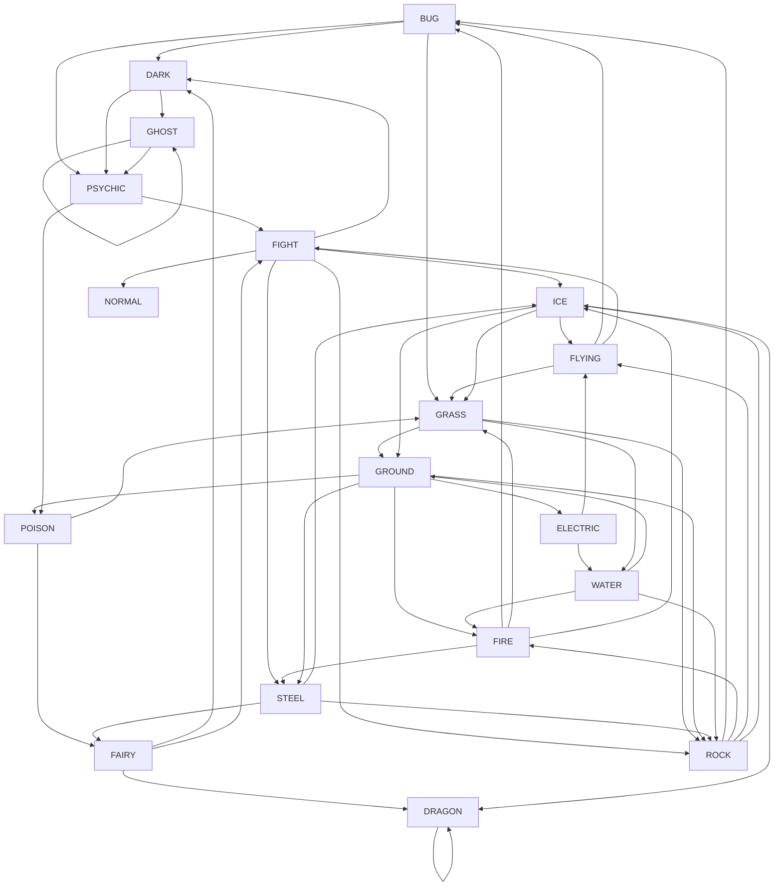

# Pokémon Type Chart / All Types

```mermaid
  graph TD;
      BUG-->DARK;
      BUG-->GRASS;
      BUG-->PSYCHIC;
      DARK-->GHOST;
      DARK-->PSYCHIC;
      DRAGON-->DRAGON;
      ELECTRIC-->FLYING;
      ELECTRIC-->WATER;
      FAIRY-->DARK;
      FAIRY-->DRAGON;
      FAIRY-->FIGHT;
      FIGHT-->DARK;
      FIGHT-->ICE;
      FIGHT-->NORMAL;
      FIGHT-->ROCK;
      FIGHT-->STEEL;
      FIRE-->BUG;
      FIRE-->GRASS;
      FIRE-->ICE;
      FIRE-->STEEL;
      FLYING-->BUG;
      FLYING-->FIGHT;
      FLYING-->GRASS;
      GHOST-->GHOST;
      GHOST-->PSYCHIC;
      GRASS-->GROUND;
      GRASS-->ROCK;
      GRASS-->WATER;
      GROUND-->ELECTRIC;
      GROUND-->FIRE;
      GROUND-->POISON;
      GROUND-->ROCK;
      GROUND-->STEEL;
      ICE-->DRAGON;
      ICE-->FLYING;
      ICE-->GRASS;
      ICE-->GROUND;
      POISON-->FAIRY;
      POISON-->GRASS;
      PSYCHIC-->FIGHT;
      PSYCHIC-->POISON;
      ROCK-->BUG;
      ROCK-->FIRE;
      ROCK-->FLYING;
      ROCK-->ICE;
      STEEL-->FAIRY;
      STEEL-->ICE;
      STEEL-->ROCK;
      WATER-->FIRE;
      WATER-->GROUND;
      WATER-->ROCK;
```
