# Pokémon Type Chart / Per Type

## Bug

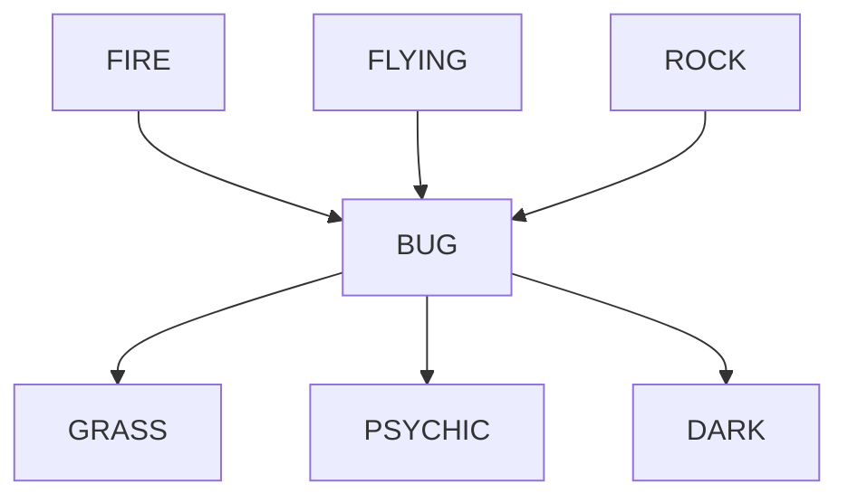
## Dark

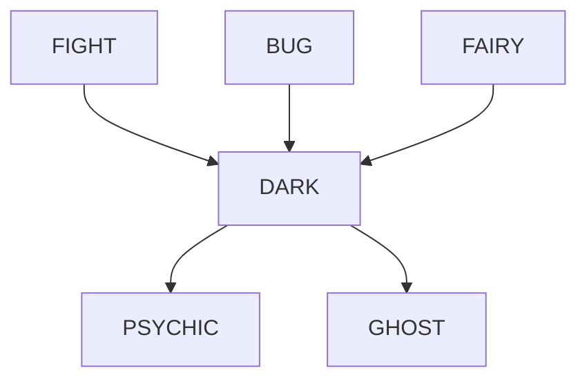
## Dragon

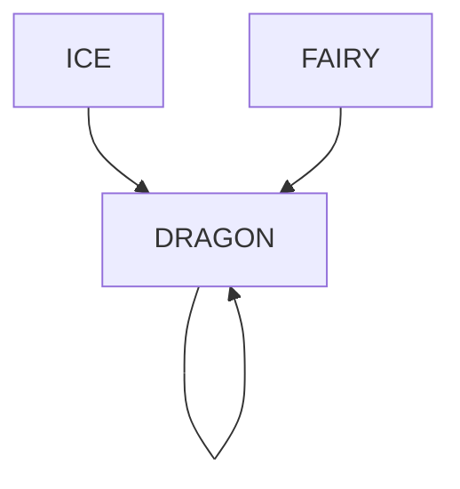
## Electric

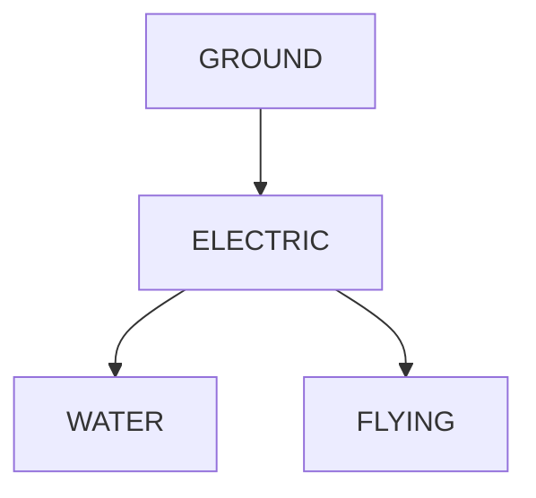
## Fairy

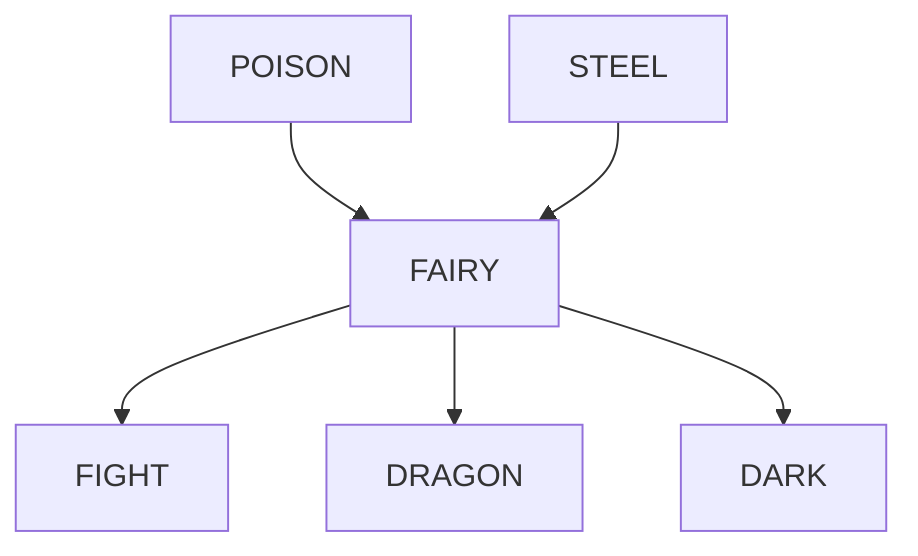
## Fight

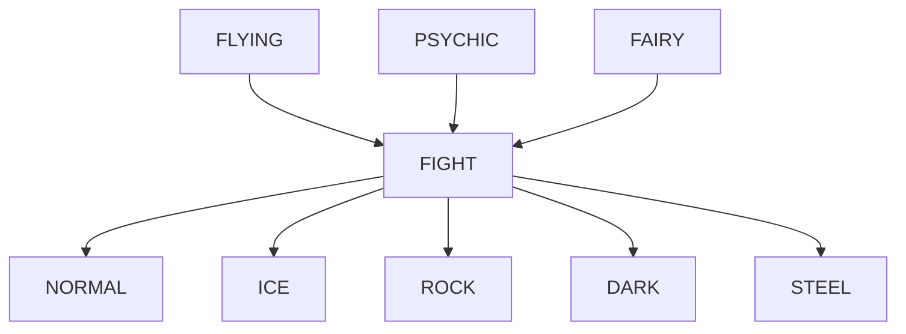
## Fire

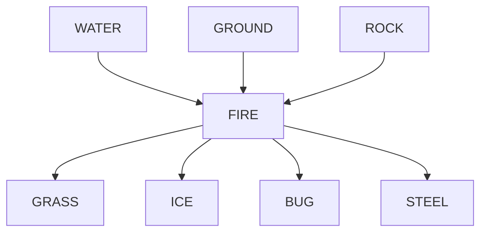
## Flying

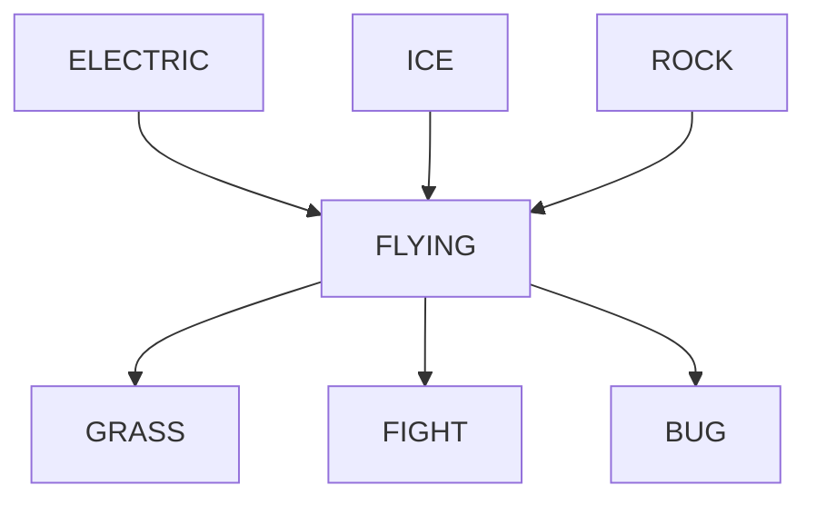
## Ghost

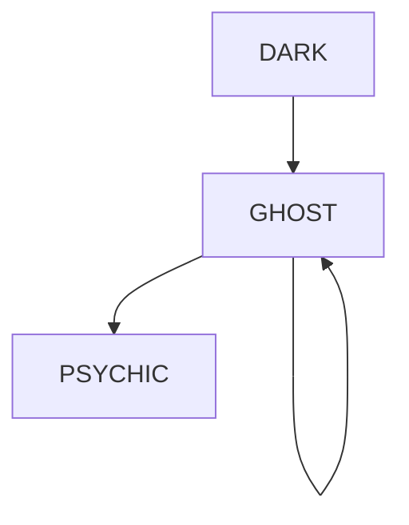
## Grass

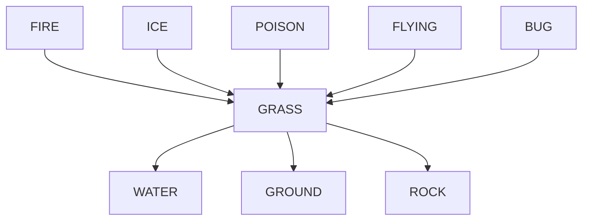
## Ground

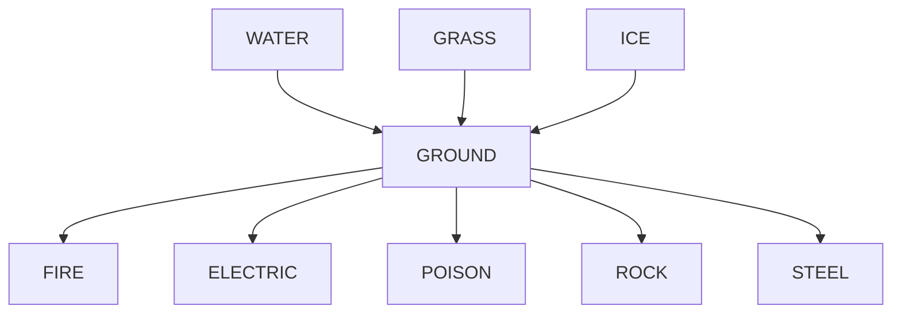
## Ice

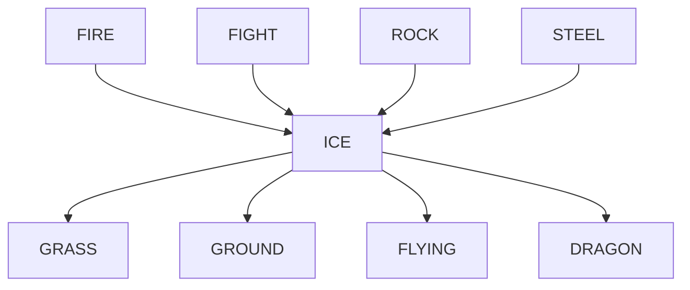
## Normal

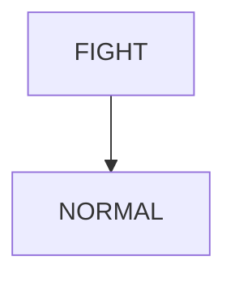
## Poison

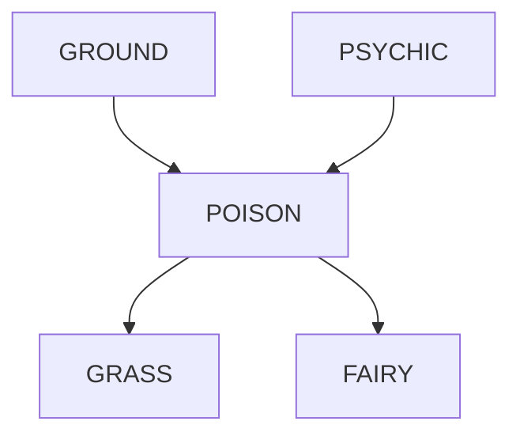
## Psychic

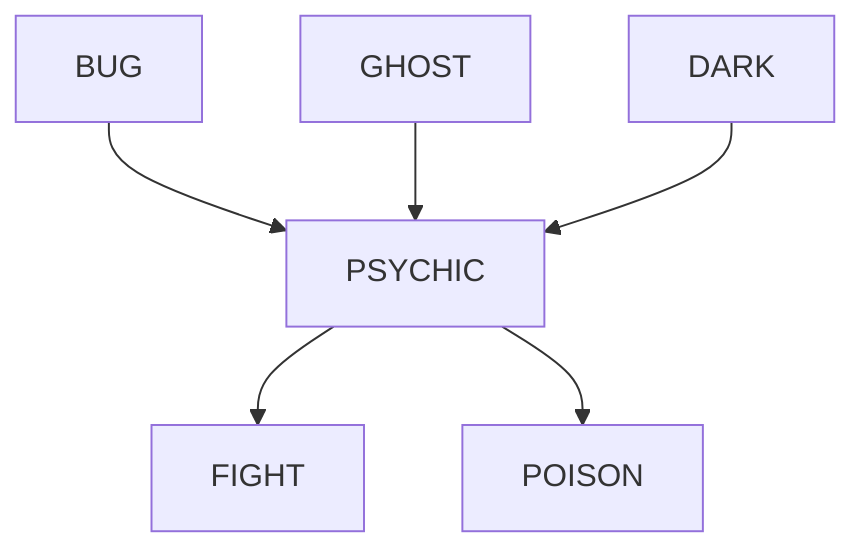
## Rock

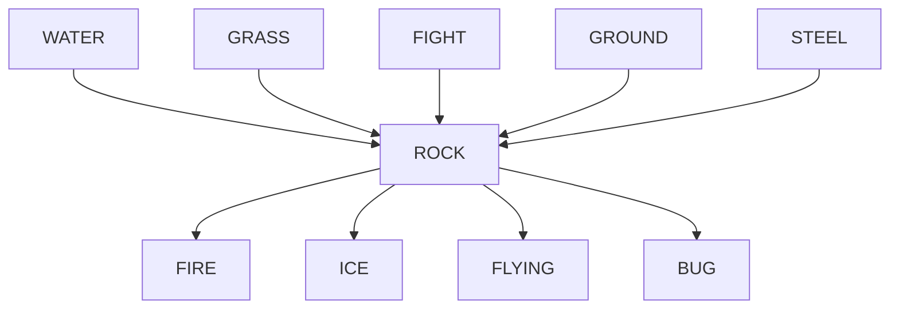
## Steel

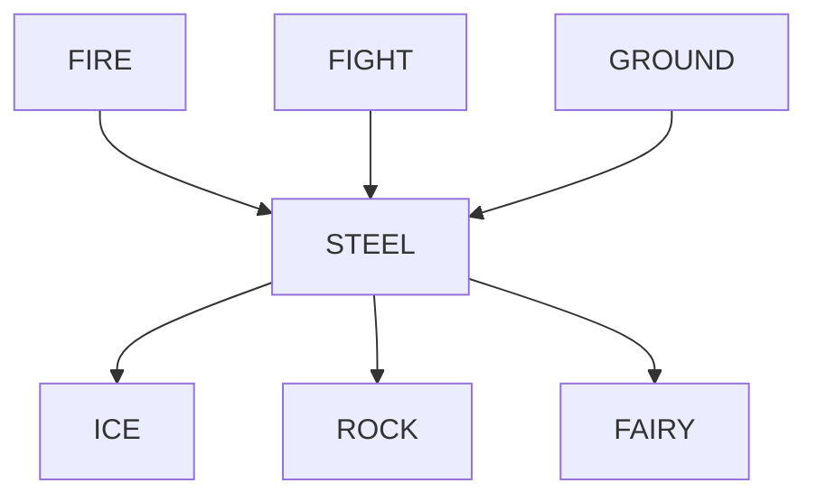
## Water

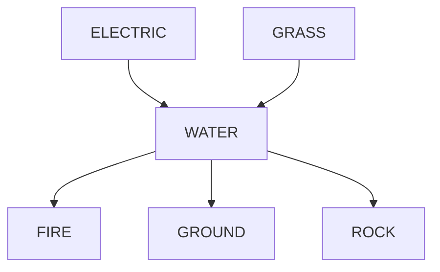
