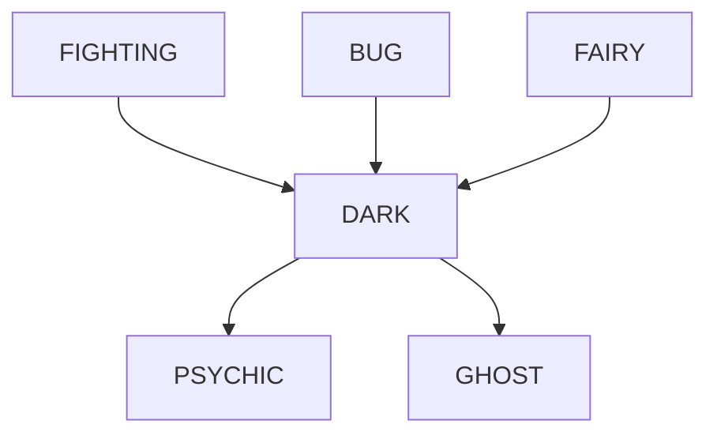
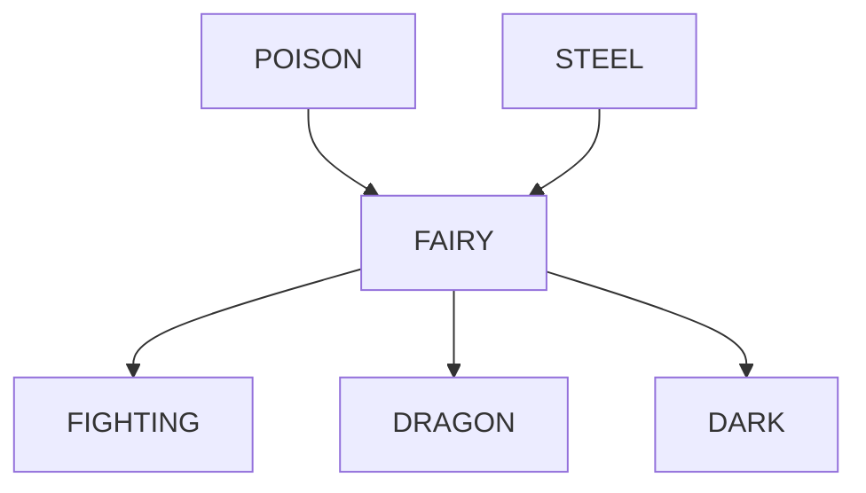
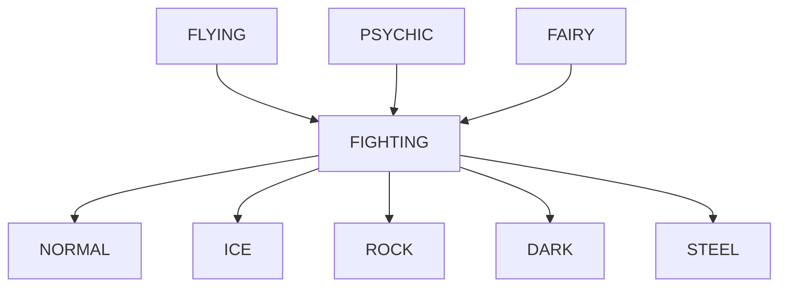
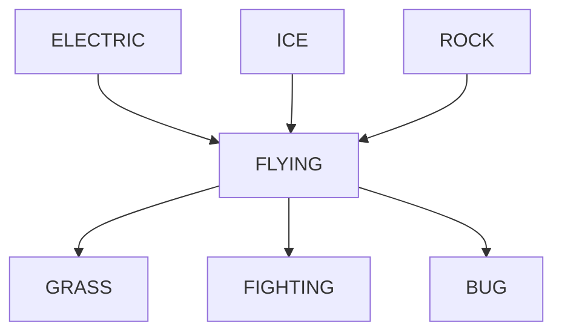
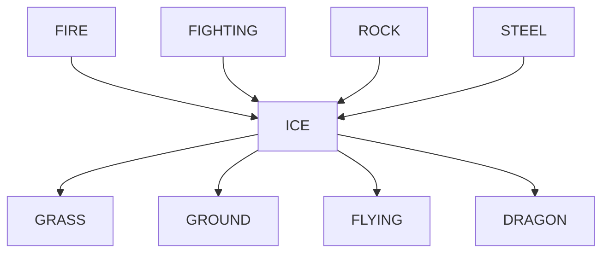
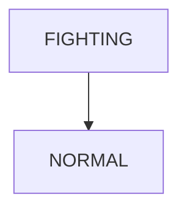
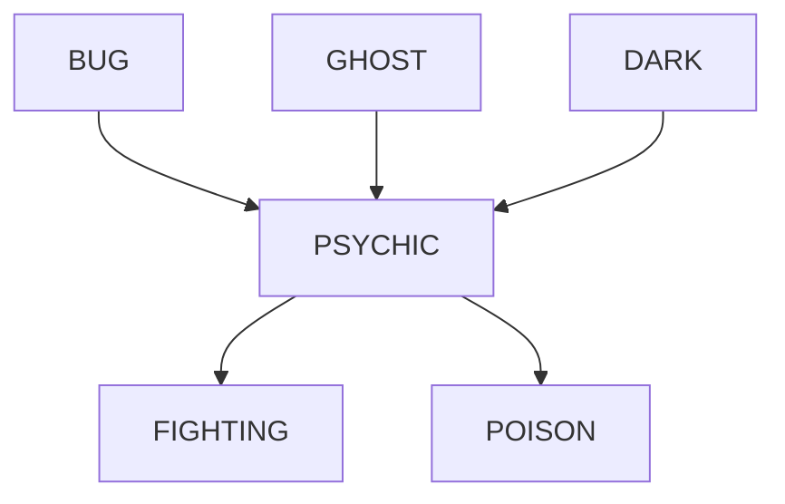
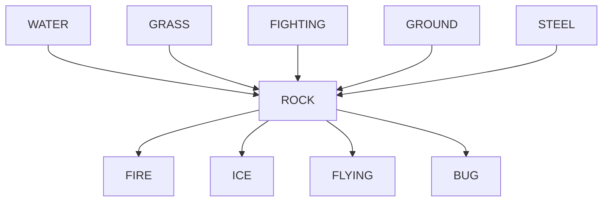
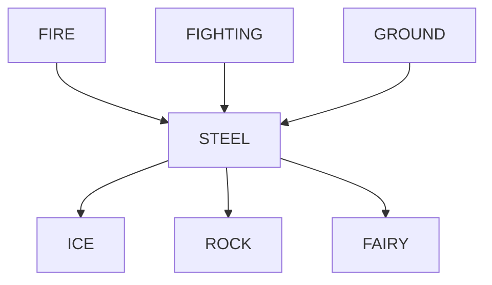

# Pokémon Type Chart / Per Type

## Bug

## Dark

## Dragon

## Electric

## Fairy

## FIGHTING

## Fire

## Flying

## Ghost

## Grass

## Ground

## Ice

## Normal

## Poison

## Psychic

## Rock

## Steel

## Water

